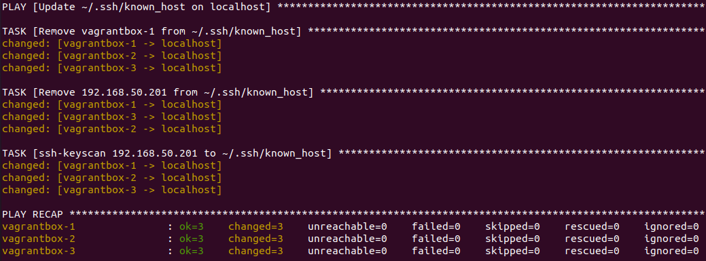
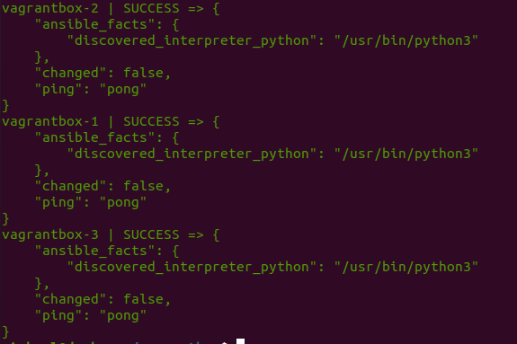
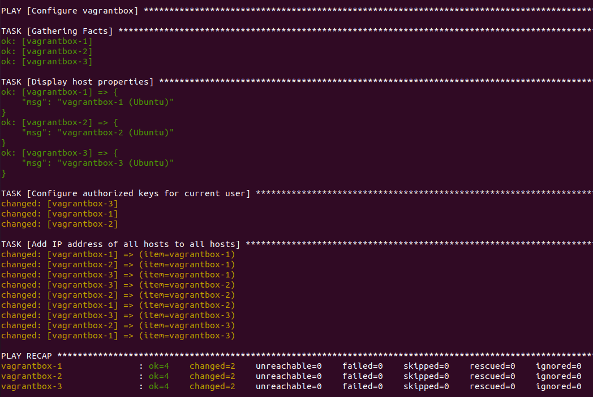

# vagrantbox

Vagrant helper to create local VMs to play with distributed systems like [K3S](https://github.com/mborne/k3s-deploy#k3s-deploy).

## Requirements

* VirtualBox or [KVM](docs/kvm.md)
* **Vagrant** to start VM (see [developer.hashicorp.com - Install Vagrant](https://developer.hashicorp.com/vagrant/downloads))
* **Ansible** to configure host and VM (see [docs.ansible.com - Installing Ansible on Ubuntu](https://docs.ansible.com/ansible/latest/installation_guide/installation_distros.html#installing-ansible-on-ubuntu))
* Optional (http proxy) : `vagrant plugin install vagrant-proxyconf` to forward `HTTP_PROXY`, `HTTPS_PROXY` and `NO_PROXY`.

## Parameters

See supported env vars in [Vagrantfile](Vagrantfile) :

| Name                   | Description                                                             | Default value      |
| ---------------------- | ----------------------------------------------------------------------- | ------------------ |
| `VAGRANTBOX_BOX`       | Base image from [Vagrant Cloud](https://app.vagrantup.com/boxes/search) | `"ubuntu/jammy64"` |
| `VAGRANTBOX_NUM_NODES` | Number of VM                                                            | `4`                |
| `VAGRANTBOX_NETWORK`   | Network for VM                                                          | `"192.168.50"`     |
| `VAGRANTBOX_MEMORY`    | VM memory in Mo                                                         | `"2048"`           |


## Usage

### Vagrant

| Description     | Command                                                            |
| --------------- | ------------------------------------------------------------------ |
| Start VMs       | `vagrant up` (VirtualBox) or `vagrant up --provider=libvirt` (KVM) |
| Check VM status | `vagrant status`                                                   |
| Connect to a VM | `vagrant ssh vagrantbox-1`                                         |
| Destroy VMs     | `vagrant destroy -f`                                               |

(see also [gist.github.com - wpscholar/vagrant-cheat-sheet.md](https://gist.github.com/wpscholar/a49594e2e2b918f4d0c4#file-vagrant-cheat-sheet-md))

### Ansible 

### Quick start

You may use [quick-start.yml](quick-start.yml) playbook :

```bash
# /etc/hosts edition requires sudo
ansible-playbook -i inventory quick-start.yml --ask-become-pass
# /etc/hosts edition can be disabled
ansible-playbook -i inventory quick-start.yml -e configure_host_enabled=false
```

> See [quickstart demo](docs/quickstart-demo.md).


### Step by step

#### Configure localhost with Ansible

* Update `~/.ssh/known_host` on localhost : `ansible-playbook -i inventory clear-ssh.yml`



* Check connectivity : `ansible -i inventory all -m ping`



* Add `/etc/hosts` : `ansible-playbook -i inventory configure-host.yml --ask-become-pass`

#### Configure VMs with Ansible

* Add your public key to vagrant user and configure `/etc/hosts` : `ansible-playbook -i inventory configure-vm.yml`



* Upgrade system packages :  `ansible-playbook -i inventory upgrade.yml`

## License

[MIT](LICENSE)

## Ressources

* [Using vagrantbox on windows](docs/windows.md)
* [blog.christophersmart.com - Using a dynamic libvirt inventory with Ansible](https://blog.christophersmart.com/2022/04/03/using-a-dynamic-libvirt-inventory-with-ansible/)
